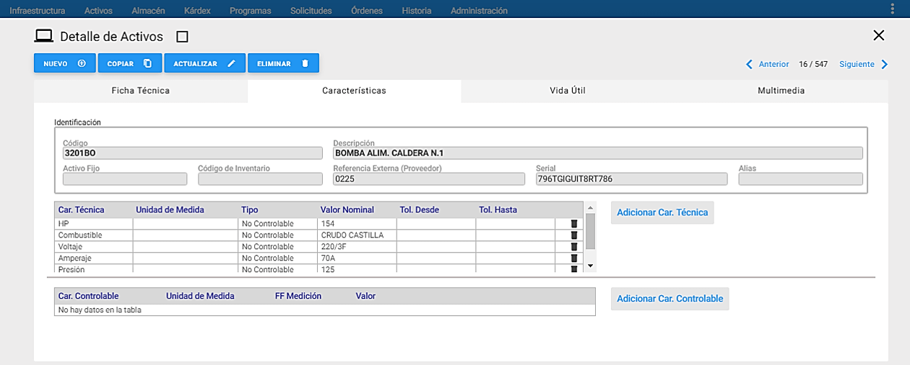

La Ficha Técnica de un Activo/Equipo es el conjunto de información que lo define como un Activo de la empresa y también como un Objeto de Mantenimiento.  Como activo de la empresa se define información relacionada a su Número de Activo o Número de Inventario, lo relacionado con el Centro de Costo al que presta sus servicios y su respectivo Responsable, además de sus fechas y costos de compra.

Como Objeto de Mantenimiento se define la información técnica del Activo/Equipo. Esta porción de información técnica se descompone en: 
- Información General y Contadores.
- Información sobre Características Técnicas
- Información Vida Útil
- Metrología (compañías que requieran esta información)
- Información Biomédica (Para las compañías biomédicas)
- Multimedia

Cada una de estas porciones se revisará detenidamente.

**Nota:** Antes de proceder a registrar un Activo (Ficha Técnica), es importante verificar que toda la información prerrequisito exista en el Sistema. Se considera Información Prerrequisito: su **Ubicación Física** y **Centro de Costo**, información revelante secundaria: Proveedor,  Fabricante y Características del Activo. Esto garantiza una definición ágil del Activo, al tiempo que garantiza que cada nuevo registro similar que sea copiado desde un original sea generado con la información integral.

En muchos procesos posteriores como registro de Programas de Mantenimiento (PM), Solicitudes de Servicio (SS), Paros (PA/DFA) y Órdenes de Trabajo (OT) **AM** muestra automáticamente los campos de Ubicación Física, Centro de Costo, Activo Fijo, Alias, etc. con el hecho de asociar el Activo. Esta es otra razón para involucrar desde el comienzo tales campos en el registro del Activo/Equipo.

## Información Universal

Es el conjunto de información genérica que es válida para cualquier Activo/Equipo, sin distinción del tipo o de la función  que  desempeña. Código, Descripción, Ubicación Física, Centro de Costo, Proveedor,Activo Fijo, Fabricante, Número de Serie, Tipo, Modelo, etc. son un conjunto de datos que encajan en el concepto de Información Universal. Son estos datos que son definibles a cualquier Objeto de Mantenimiento.

## Información Características  

Es un conjunto de datos propio del Activo/Equipo que depende del mismo, de su tipo o modelo y que se relaciona con sus características técnicas y funcionales. Cuando por ejemplo se define la información característica de un motor se  toman en cuenta parámetros como su Voltaje, Amperaje, HP, RPM, Fases, Conexión, Blindaje, Factores de Potencia y de Servicio, etc.

Ninguno  de  estos  parámetros  por ejemplo,  es  de  utilidad si la intención es definir un Equipo de cómputo o una instalación locativa, en cuyos casos los parámetros característicos serían muy diferentes.

Sobre esta  información  característica, **AM** ofrece una tabla preconfigurada con nombres de parámetros que  pueden ser escogidos al momento de configurar la ficha técnica. Tales nombres de parámetros son modificables, adecuables,  borrables e incluso es posible adicionar nuevos a la tabla. Se pretende que el tratamiento que se dé a estos parámetros a todo lo largo del sistema sea uniforme y estandarizado. Por esto la Administración de la **Tabla de Características en Infraestructura** debe tener permisos restringidos y ser centralizada.

_**Imagen 1.** Ventana Detalle de Activos - Características_

## Información sobre Contadores

Es el conjunto de información referente al contador del Activo/Equipo. El contador es normalmente un medidor de la cantidad de trabajo realizada por el Activo, en función de una unidad de producción predefinida, como Horas trabajadas, Kilómetros recorridos por el vehículo, o número de Batches o Lotes o Piezas producidas.

Esta información se requiere sólo cuando el Activo usa un contador que sirve para programar Actividades de Mantenimiento, mediante el módulo <a class="btn blue px-6">Programas</a> del Menú Principal.

Otro ejemplo, en forma alterna, cuando se trata de un Activo/Equipo que no trabaja con base en una Función Uniforme, sino en función de oferta y demanda, como por ejemplo un compresor.

De respaldo, **AM** posibilita definir un Estándar de Planeación, que es un dato promedio del trabajo realizado por ese Activo en una Unidad de Tiempo, y que se debería ser definido para el mes. Este dato se establece con base en registros históricos o estadísticos del desempeño del Activo. Este dato es utilizado por el Módulo de Programas de Mantenimiento, cuando debe realizar una proyección hacia el futuro.

