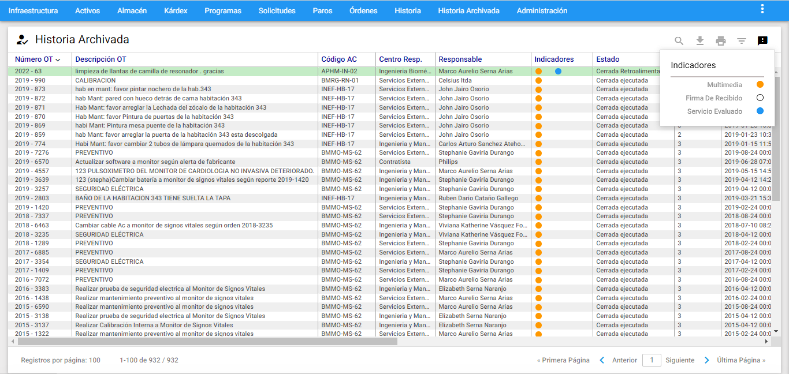
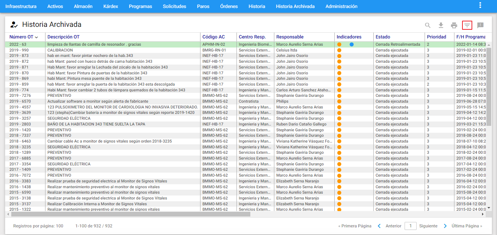
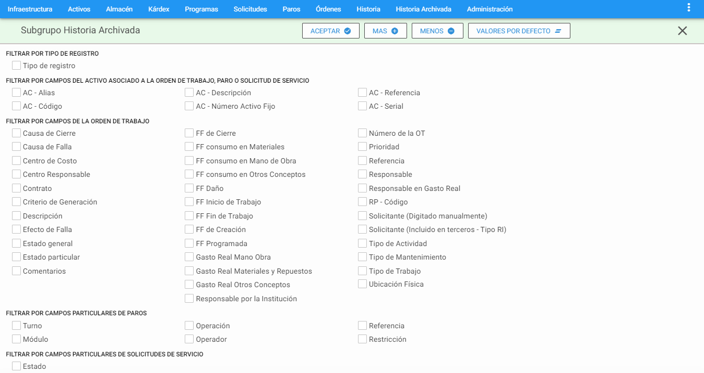
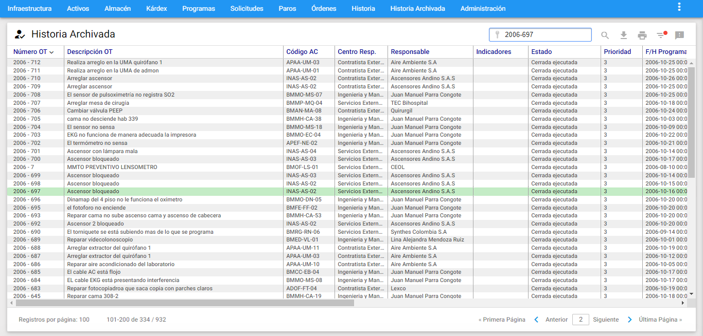
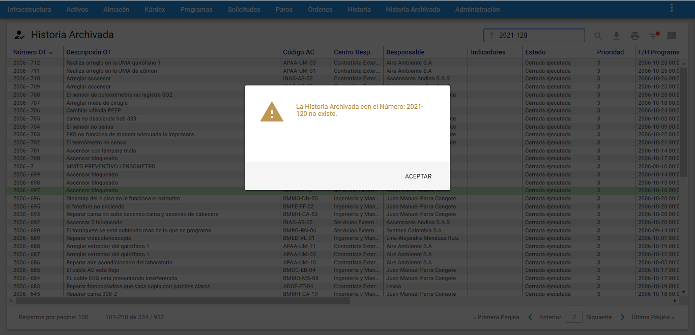
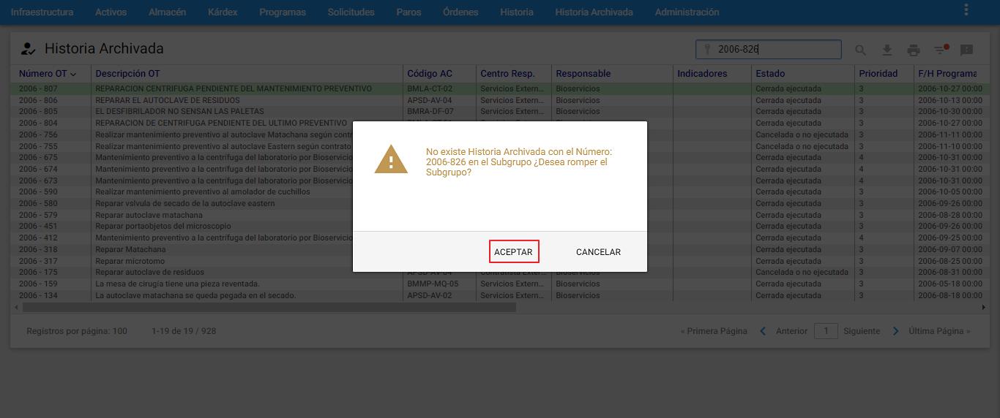
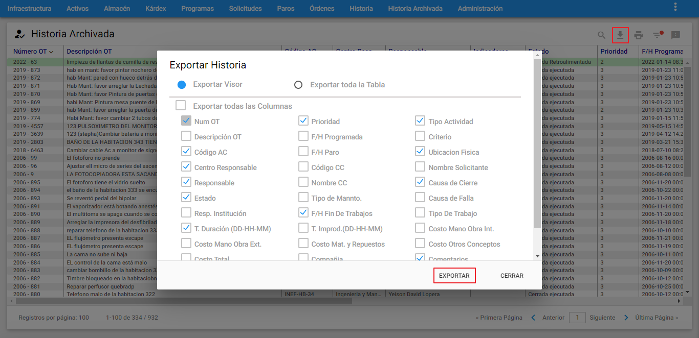
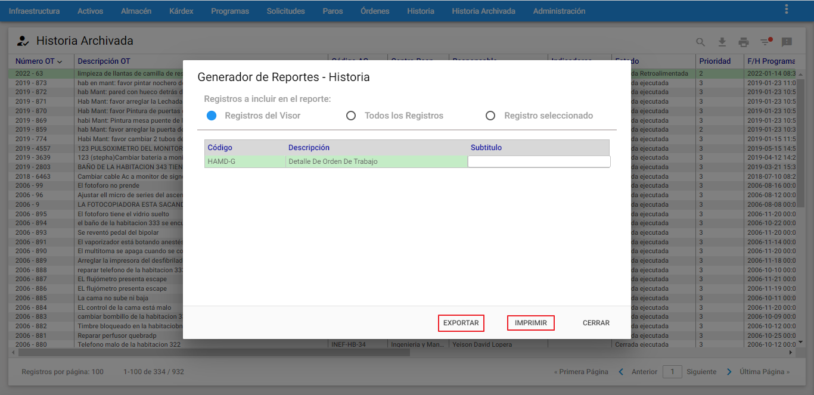

# Ventana submenú de Historia Archivada

## Indicadores

Es posible saber cuáles registros de SS, OT y Paros, tienen Multimedia, Servicio Evaluado y Firma de Recibido (sólo para SS y OTs diligenciadas desde AMovil) directamente desde la ventana visor, sobreponiendo el cursor en el ícono de Indicadores  ubicado en la parte superior derecha de la ventana como se muestra a continuación:

_**Imagen 12.** Historia Archivada- Indicadores_

El significado de los colores es el siguiente:

- **Pelota Naranja:** SS/OT que tienen asociada Multimedia.
- **Pelota Blanca:** Indican SS/OT que tienen registrada la firma de recibido (AMovil)
- **Pelota Azul:** SS/OT con servicio evaluado.

## Subgrupo

Se usa para seleccionar un grupo de información, sobre la que se estudiará uno a uno de los registros incluidos o para imprimir el único reporte existente. Puede incluir OT, SS o Paros.

Para ingresar a esta opción se debe dar clic al icono , ubicado en la parte superior derecha de la ventana Visor de HA.

_**Imagen 13.** Historia Archivada- Ir a Subgrupos_

Cada criterio trabaja en conjunto con los demás, con el operador intersección.

Cada criterio aparece inicializado en un valor global que permite mostrar todas las OT, SS y Paros de HA. Lo que significa que de no escoger un criterio se obtiene como resultado del subgrupo, el mismo conjunto completo de todas las OT Históricas, SS y PA.

**AM** mantiene activo cualquier subgrupo en cada módulo, hasta que el usuario lo modifique o restablezca los valores estándar. Esto se visualiza con una pelota de color ojo sobre el , también se visualiza en la parte inferior izquierda el número de registros encontrados sobre el total de registros (N/M).

El programa permite entonces hacer selección de un grupo de cualquier tipo de los tres registros mencionados de acuerdo con los criterios seleccionados en la siguiente ventana.

Los campos de datos son los siguientes:

_**Imagen 14.** Historia Archivada- Ir a Subgrupos_

**1. FILTRAR POR TIPO DE REGISTRO**

**Tipo  de  Registro:**  Tres tipos de registros conforman la Historia de Mantenimiento de SS, OT y Paros/Averías. Con este filtro se seleccionan los registros de un tipo, de todos los tipos o de alguna combinación de ellos.

**2. FILTRAR POR CAMPOS DEL ACTIVO ASOCIADO A LA ORDEN DE TRABAJO, PARO O SOLICITUD DE SERVICIO**

**AC-Alias:** Este campo filtra las OT Históricas, SS y PA para los Activos cuyo Alias corresponda a los valores aquí definidos. En este campo se pueden utilizar los comodines (%).

**AC-Código:** Esta selección agrupa las OT Históricas, SS y PA cuyo Activo/Equipo coincidan con el relacionado en este criterio. Es posible definir el código completo o una porción del mismo. Por ejemplo: si se escribe 341%, se seleccionan todas las OT Históricas, SS y PA cuyo código de Activo inicia por 341. El porcentaje (%) es un carácter comodín que significa “todos”. También, es posible seleccionar el Activo a través del visor de Activos. Para ello se da un clic sobre el icono de filtro  de la respectiva ventana. Acto seguido se muestra la ventana de visor de Activos junto con la posibilidad de filtrar. Una vez se encuentra dicho Activo, se selecciona dando un clic sobre cualquiera de sus campos. A continuación, se da un clic sobre botón <a class="btn white">Aceptar</a> de esa ventana o se hace doble clic sobre el registro seleccionado. Inmediatamente ese código aparece en el primer campo de la línea de Activo en la forma de registro de OT, SS y PA.

**AC-Descripción:** Selecciona las OT Históricas, SS y PA asociados a los Activos según criterios que se fundamenten en su descripción. Ejemplo: %Motor% selecciona todos los Activos en cuya descripción, en cualquier posición, tengan la palabra “Motor”.

**AC-Número Activo Fijo:** Este campo preselecciona las Órdenes de Trabajo Históricas, SS y PA para el o los Activos cuyo Número de Activo corresponde a los valores aquí definidos. En este campo se pueden utilizar los comodines.

**AC-Referencia:** Esta opción permite seleccionar las OT Históricas, SS y PA de acuerdo con su número de referencia.

**AC-Serial:** Esta alternativa permite seleccionar las OT Históricas, SS y PA de acuerdo con el número serial del Equipo/Activo objeto de mantenimiento. El campo acepta comodines(%).

**3. FILTRAR POR CAMPOS DE LA ORDEN DE TRABAJO**

**Causa de Cierre:** Permite buscar las OT Históricas que tienen una Causa de Cierre específica, es posible utilizar comodines. Existen dos formas de definir la Causa de Cierre de la OT Histórica. La primera es seleccionando la Causa de la lista desplegable. La segunda es dando clic al icono de candado , este se desbloquea  para digitar manualmente digitando a continuación segmentos del nombre de la Causa de Cierre utilizando comodines. Cuando se utilizan comodines (%), es posible seleccionar OT Histórica cuya Causa de Cierre tenga parte del nombre igual.

**Causa de Falla:** Permite buscar las OT Históricas, SS y PA que tienen una Causa de Falla específica. Existen dos formas de definir la Causa de Falla de la OT, SS y PA. La primera es seleccionando la Causa de Falla de la lista desplegable. La segunda es dando clic al icono de candado , este se desbloquea y a continuación se digitan segmentos del nombre de la Causa de Falla. Cuando se utilizan comodines, es posible seleccionar OT, SS y PA cuya Causa de Falla tenga parte del nombre igual.

**Centro de Costo:** Permite la selección de OT Históricas, SS y PA de acuerdo con el Centro de Costo asignado a ella. Existen dos formas de definir el Centro de Costo. La primera es seleccionando el Centro de Costo de la lista desplegable. La segunda es dando clic al icono de candado , luego este se desbloquea   digitando a continuación segmentos del nombre del Centro de Costo. Cuando se utilizan comodines (%), es posible seleccionar las OT Históricas, SS y PA pertenecientes a Centros de Costo que tengan parte del nombre igual. Por ejemplo: Sistema% selecciona todas los registros Históricas, SS y PA en cuyo Centro de Costo exista la palabra Sistema, independiente de si se está hablando del Sistema de Agua, de Vapor o de Energía.

**Centro responsable:** Agrupa las OT Históricas, SS y PA cuyo Centro Responsable sea el seleccionado, es posible utilizar comodines. Existen dos formas de definir el Centro Responsable. La primera es seleccionando el Centro Responsable de la lista desplegable. La segunda es dando clic al icono de candado “Utilizar comodines” y digitando a continuación segmentos del nombre del Centro Responsable utilizando comodines.

**Contrato:** Permite filtrar las OT Históricas que se encuentren asociadas a un contrato ya definido en la tabla de “CONTRATO” en el módulo de Infraestructura. Existen dos formas de definir el Contrato de la OT Histórica. La primera es seleccionando el Contrato de la lista desplegable. La segunda es dando clic al icono de candado , este se desbloquea  y digitando a continuación segmentos del nombre del Contrato utilizando comodines (%). Cuando se utilizan comodines, es posible seleccionar OT Histórica cuyo Contrato tenga parte del nombre igual.

**Criterio de Generación:** Permite seleccionar el subconjunto de OT Históricas generadas desde PM, bajo el Criterio de Programación “XX” seleccionado. Es posible utilizar comodines (%). Los criterios son:

| **Abreviatura** | **Significado**         |
| --------------- | ----------------------- |
| **MM**          | Mensual                 |
| **SS**          | Semanal                 |
| **SM**          | Semestral               |
| **AN**          | Anual                   |
| **DD**          | Días (Mín. 3)           |
| **SA**          | Semanas del año         |
| **+M**          | Meses (mas de uno)      |
| **+S**          | Semanas (mas de una)    |
| **KI**          | Contador por Incremento |
| **KL**          | Contador por Límite     |
| **FK**          | Frecuencia y Contador   |
| **TM**          | Trimestral              |
| **+K**          | Contador (mas de uno)   |
| **??**          | Sin Criterio            |

**Descripción:** Esta opción permite seleccionar las OT Históricas, SS y PA que cumplan con el criterio de selección establecido en este campo, es posible utilizar la funcionalidad de comodines (%).

**Efecto de Falla:** Este campo permite seleccionar las OT Históricas que posean una causa de falla específica, es posible utilizar comodines. Existen dos formas de definir el Efecto de Falla de la OT Histórica. La primera es seleccionando el Efecto de Falla de la lista desplegable. La segunda es dando clic al icono de candado 
 este se desbloquea  y permite digitar a continuación segmentos del nombre del Efecto de Falla. Se puede usar comodines (%).

**Estado General:** Permite seleccionar las OT Históricas de acuerdo con su estado de cierre: “Cerradas” que fueron normalmente ejecutadas o “Canceladas”..

**Estado Particular:** Permite seleccionar las OT Históricas, SS y PA de acuerdo con su estado. Al descolgar aparece el listado de todos los estados posibles para una Orden de Trabajo Histórica, SS y PA.

**Comentarios:**  Filtra los registros que coincidan con el comentario aquí en este campo. 

**FF de Cierre:** Este criterio filtra las OT Históricas por un rango de la Fecha de Cierre. Aparecen dos campos: Desde y Hasta. En cada uno de ellos se digita una fecha. De no digitar el campo “Desde”, se buscan los registros Históricas cuya fecha de cierre esté en el lapso anterior a la fecha digitada en “Hasta”. De no digitar el campo “Hasta”, se buscan las OT Históricas cuya fecha de cierre esté en un lapso posterior a la digitada en “Desde”.

**FF Consumo en Materiales:** Este criterio filtra las Órdenes de Trabajo Históricas por un rango de la Fecha de consumo de materiales en el Gasto Real de la OT. Aparecen dos campos: Desde y Hasta. En cada uno de ellos se digita una fecha. De no digitar el campo “Desde”, se buscan las Órdenes de Trabajo cuya fecha de consumo de materiales esté en el lapso anterior a la fecha digitada en “Hasta”. De no digitar el campo “Hasta”, se buscan las OT cuya fecha de consumo de materiales esté en un lapso posterior a la digitada en “Desde”.

**FF Consumo en Mano de Obra:** Este criterio filtra las OT Históricas por un rango de la Fecha de consumo de mano de obra en el Gasto Real de la OT. Aparecen dos campos: Desde y Hasta. En cada uno de ellos se digita una fecha. De no digitar el campo “Desde”, se buscan los registros cuya fecha de consumo de mano de obra esté en el lapso anterior a la fecha digitada en “Hasta”. De no digitar el campo “Hasta”, se buscan las OT cuya fecha de consumo de mano de obra esté en un lapso posterior a la digitada en “Desde”.

**FF Consumo en Otros Conceptos:** Este criterio filtra las OT Históricas por un rango de la Fecha de consumo de gastos indirectos en el Gasto Real de la OT. Aparecen dos campos: Desde y Hasta. En cada uno de ellos se digita una fecha. De no digitar el campo “Desde”, se buscan los registros cuya fecha de consumo de mano de obra esté en el lapso anterior a la fecha digitada en “Hasta”. De no digitar el campo “Hasta”, se buscan las OT cuya fecha de consumo esté en un lapso posterior a la digitada en “Desde”.

**Fecha de Daño:**Este criterio filtra los registros Históricos por un rango de la Fecha de Daño, Paro o Avería. Aparecen dos campos: Desde y Hasta. En cada uno de ellos se digita una fecha. De no digitar el campo “Desde”, se buscan las OT Históricas cuya fecha de Daño esté en el lapso anterior a la fecha digitada en “Hasta”. De no digitar el campo “Hasta”, se buscan las OT Históricas cuya fecha de Daño esté en un lapso posterior a la digitada en “Desde”.

**FF Inicio de Trabajo:** Este criterio filtra los registros Históricos por un rango de la Fecha de Inicio de Trabajos. Aparecen dos campos: Desde y Hasta. En cada uno de ellos se digita una fecha. De no digitar el campo “Desde”, se buscan las Órdenes de Trabajo Históricas cuya fecha de inicio esté en el lapso anterior a la fecha digitada en “Hasta”. De no digitar el campo “Hasta”, se buscan los registros cuya fecha de inicio esté en un lapso posterior a la digitada en “Desde”.

**FF Fin de Trabajo:** Este criterio filtra los registros Históricos por un rango de la Fecha de Fin de Trabajos. Aparecen dos campos: Desde y Hasta. En cada uno de ellos se digita una fecha. De no digitar el campo “Desde”, se buscan los registros cuya fecha de fin de trabajos esté en el lapso anterior a la fecha digitada en “Hasta”. De no digitar el campo “Hasta”, se buscan las OT Históricas cuya fecha de fin de trabajos esté
 en un lapso posterior a la digitada en “Desde”.

**Fecha de Creación:** Este criterio filtra los registros Históricos por rango en la fecha de su creación. Aparecen dos campos: Desde y Hasta. En cada uno de ellos se digita una fecha. De no digitar el campo “Desde”, se buscan las Órdenes de Trabajo Históricas cuya fecha programada esté en el lapso anterior a la fecha digitada en “Hasta”. De no digitar el campo “Hasta”, se buscan los registros cuya fecha de creación esté en un lapso posterior a la digitada en “Desde”.

**FF Programada:** Este criterio filtra las OT Históricas por un rango de la Fecha Programada. Aparecen dos campos: Desde y Hasta. En cada uno de ellos se digita una fecha. De no digitar el campo “Desde”, se buscan las OT Históricas cuya fecha programada esté en el lapso anterior a la fecha digitada en “Hasta”. De no digitar el campo “Hasta”, se buscan las OT Históricas cuya fecha de programación esté en un lapso posterior a la digitada en “Desde”.

**Gasto Real Mano Obra:**  Al seleccionar esta opción se habilita una lista desplegable donde se escoge el criterio deseado, junto con un cuadro donde se digita el valor de comparación. Los criterios son: Igual (=), Mayor (>) y Menor (<). Estos criterios actúan en comparación con el valor digitado en la casilla que se activa al lado del operador aritmético. Ejemplo: si se escoge el criterio Mayor (>) y la cantidad es 100.000, eso significa que filtrara todas las OT Históricas cuyo Gasto Real en la Mano de Obra Interna sea Mayor a Cien Mil Pesos o unidades monetarias.

**Gasto Real Materiales y Repuestos:** Al seleccionar esta opción se habilita una lista despegable donde se escoge el criterio deseado, junto con un cuadro donde se digita el valor de comparación. Los criterios son: Igual (=), Mayor (>) y Menor (<). Estos criterios actúan en comparación con el valor digitado en la casilla que se activa al lado del operador aritmético. Ejemplo: si se escoge el criterio Mayor (>) y la cantidad es 100.000, eso significa que filtrara todas las OT Históricas cuyo Gasto Real en Materiales y Repuestos sea Mayor a Cien Mil Pesos o unidades monetarias.

**Gasto Real Otros Conceptos:** Al seleccionar esta opción se habilita una lista despegable donde se escoge el criterio deseado, junto con un cuadro donde se digita el valor de comparación. Los criterios son: Igual (=), Mayor (>) y Menor (<). Estos criterios actúan en comparación con el valor digitado en la casilla que se activa al lado del operador aritmético. Ejemplo: si se escoge el criterio Mayor (>) y la cantidad es 100.000, eso significa que filtrara todas las OT Históricas cuyo Gasto Real en Otros Conceptos de Costo sea Mayor a Cien Mil Pesos o unidades monetarias.

**Responsable por la Institución:** Filtra las OT Históricas de acuerdo al Responsable por Institución o la persona que recibe a satisfación. Existen dos formas de buscar el Responsable. La primera es seleccionándolo de la lista desplegable. La segunda es dando clic al icono de candado  el cual se desactiva  permitiendo digitar segmentos del nombre del Responsable, en el cual también es posible usar comodines (%). Cuando se utilizan comodines, es posible seleccionar las OT cuyo Responsable tenga una parte del nombre igual.

**Número de la OT:** Permite filtrar OT Históricas, con base en su número consecutivo. Para ello se define en el criterio un rango. Aparecen cuatro campos, para ubicar el comienzo del rango “Desde” (Año-Consecutivo) y el fin del rango “Hasta” (Año- Consecutivo). De no digitar los campos “Desde”, se buscan las OT Históricas cuyo número es inferior al digitado en “Hasta”. De no digitar los campos “Hasta”, se buscan las OT Históricas cuyo número es posterior al digitado en “Desde”.

**Prioridad:** Permite hacer subgrupo de OT Históricas, cuya prioridad es la seleccionada en este criterio, habilitándose una lista despegable desde el nivel 1 hasta el nivel 7.

**Referencia:** Esta opción permite seleccionar las OT Históricas que tienen asociado el valor seleccionado, en el campo Referencia. Es posible utilizar comodines (%).

**Responsable:** Filtra las SS, PA y OT Históricas de acuerdo al Responsable ejecutor. Existen dos formas de buscar el Responsable. La primera es seleccionándolo de la lista desplegable. La segunda es dando clic al icono de candado  el cual se desactiva  permitiendo digitar segmentos del nombre del Responsable. En este campo también es posible usar comodines (%), es posible seleccionar las OT cuyo Responsable ejecutor tenga una parte del nombre igual.

**Responsable en Gasto Real:** Permite filtrar las OT Históricas cuyo Responsable ejecutor en Gasto Real está definido en la Mano de Obra del Gasto Real. Existen dos formas de buscar el Responsable. La primera es seleccionándolo de la lista desplegable. La segunda es dando clic al icono de candado  el cual se desactiva  permitiendo digitar segmentos del nombre del Responsable. En este campo también es posible usar comodines (%), es posible seleccionar las OT cuyo Responsable definido en el Gasto Real, tenga una parte del nombre igual.

**RP-Código:** Filtra las OT Históricas cuyo Repuesto fue asociado en el Gasto Real en Materiales y Repuestos. Para definir el Repuesto de la OT Histórica, primero se elige el almacén de la lista desplegable en el primer campo. Luego de seleccionarlo, se activa automáticamente el segundo campo que permite seleccionar el Repuesto a través del visor de Materiales y Repuestos. Para ello se da un clic sobre el icono de filtro . Acto seguido se muestra la ventana de visor de Materiales y Repuestos junto con la de subgrupo para poder ubicarlo. Una vez se encuentra el Repuesto en la Tabla de visor de Materiales y Repuestos, se selecciona dando un clic sobre cualquiera de sus campos. A continuación, se da un clic sobre botón <a class="btn white">Aceptar</a> de esa ventana o se hace doble clic sobre el registro seleccionado. Inmediatamente ese código aparece en el segundo campo en la forma de registro de Ordenes de Trabajo Histórica.

**Solicitante (Digitado Manualmente):** Permite la preselección de las OT Históricas, SS y PA cuyo Solicitante fue especificado manualmente, y coincide con el definido en este campo. Se pueden utilizar los comodines (%).

**Solicitante (Incluido en terceros - Tipo RI):** Permite la preselección de las OT Históricas, SS y PA cuyo Solicitante fue seleccionado de la tabla de terceros (como RI) y coincide con el definido en este criterio. Existen dos formas de definir el Solicitante de la OT, SS y PA. La primera es seleccionando el Solicitante de la lista desplegable. La segunda es dando clic al icono de candado  y digitando a continuación segmentos del nombre del Solicitante utilizando comodines (%). Cuando se utilizan comodines, es posible seleccionar OT Histórica, SS y PA cuyo Solicitante tenga parte del nombre igual.

**Tipo de Actividad:** Filtra las OT Históricas, SS y PA por Tipo de Actividad. Existen dos formas de definir el Tipo de Actividad de la OT Histórica, SS y PA. La primera es seleccionando el Tipo de Actividad de la lista desplegable. La segunda es dando clic al icono de candado  y digitando a continuación segmentos del nombre del Tipo de Actividad utilizando comodines (%). Cuando se utilizan comodines, es posible seleccionar OT Histórica, SS y PA cuyo Tipo de Actividad tenga parte del nombre igual.

**Tipo de Mantenimiento:** Filtra las OT Históricas, SS y PA por el Tipo de Mantenimiento elegido de la lista desplegable. Al activar ésta opción se activan las siguientes opciones: Correctivo, Preventivo, Preventivo Manual, Predictivo, Metrología, Inspección, Lubricación, Otro-Mantto y Otro.

**Tipo de Trabajo:** Agrupa las OT Históricas, SS y PA de acuerdo al TT seleccionado, sin importar si tienen otros tipos de trabajo activos. Incluso, es posible seleccionarlos todos al mismo tiempo.

**Ubicación Física:** Permite la selección de las OT Históricas, SS y PA cuyo Activo esté en la ubicación física que se determina en este criterio. Existen dos formas de filtrar la Ubicación Física. La primera es seleccionando la Ubicación Física de la lista desplegable. La segunda es dando clic al icono de candado  el cual se desactiva  y permite digitar a continuación segmentos del nombre de la Ubicación Física. Es posible utilizar comodines (%) y seleccionar OT cuyo Activo esté en una Ubicación Física que tenga parte del nombre igual. Por ejemplo: Cava% selecciona los registros cuya Ubicación Física empieza por la palabra Cava, independientemente de si se está hablando de la Cava de Fermentación, Maduración o Contrapresión.

**4. FILTRAR POR CAMPOS PARTICULARES DE PAROS**

**Turno:** Permite filtrar de los PA Históricos cuyo turno laboral indique en el cual se produjo el paro. Se puede elegir entre los turnos 1, 2, 3 y 4.

**Módulo:** Permite filtrar de los PA Históricos, cuyo campo tenga  definido información documental, variable, según las necesidades propias de la Organización.

**Operación:** Permite filtrar de los PA Históricos cuya operación  fue la que se registró en el momento en que se produjo el fallo, daño o avería.

**Operador:** Permite filtrar de los PA Históricos cuyo operario de mantenimiento corresponde al que está registrado en la tabla de  Terceros del módulo de  Infraestructura. La selección del operario también se puede realizar utilizando los comodines (%).

**Referencia:** Permite filtrar los PA Históricos que tengan registrada la referencia elegida. En este campo se pueden utilizar los comodines.

**Restricción:** Permite la selección de los PA Históricos que hayan sido o no restrictivo en el momento en que se presentó el fallo del 
Activo/Equipo.

**5. FILTRAR POR CAMPOS PARTICULARES DE SOLICITUDES DE SERVICIO**

**Estado:** Permite seleccionar las SS Históricas de acuerdo con su estado de cierre: **Cerrada no ejecutada**, **Cerrada ejecutada**, **Cerrada con OT** o **Cerrada Retroalimentada**.

_**Nota:** Es importante tener en cuenta que cuando se están realizando los subgrupos, se pueden utilizar uno o varios de los criterios anteriores, simultáneamente. Además es posible hacer unión de selecciones. Esto significa que inmediatamente después de haber realizado una selección, es posible hacer otra y unir el resultado de las dos. Para ello, tras definir los criterios de la segunda selección, se da un clic al botón <a class="btn white">Mas </a> o <a class="btn white">Menos </a>en lugar de darlo al botón <a class="btn white">aceptar </a>._ 

### Buscar 

Esta opción de búsqueda rápida se encuentra ubicada al lado superior derecho de la ventana Visor. Es una lupa  que abre un campo al lado izquierdo y que indica digitar el número de la OT, SS o Paro. Luego de digitar la información, se presiona la tecla <a class="btn">Enter </a> y a continuación se sombrea el registro deseado en el Visor:

_**Imagen 15.** Historia Archivada - Exportar las OT, SS y PA_

En caso de escribir el consecutivo con algún error o no existente, el sistema muestra un mensaje de alerta:

_**Imagen 16.** Mensaje Alerta - Ir a OT_

Si se tiene un subgrupo establecido y se digita el consecutivo de una OT, SS o Paro que no esté dentro del subgrupo, el sistema muestra un mensaje de adventencia, donde se le pregunta al usuario si desea deshacer el subgrupo:

_**Imagen 17.** Mensaje Advertencia - Ir a OT_

## Exportar

Esta opción permite exportar los ítems o campos de la ficha técnica de OT, bien sea, para exportar todas las OTs o las provenientes de un subgrupo a un archivo de Excel que se descarga automáticamente en la estación cliente.
Para efectuar este proceso, se da clic en Exportar  mostrando las siguientes opciones de exportación:

En la gráfica anterior, se aprecian sus componentes y sus respectivos contenidos:

**Exportar Visor:** Esta opción exporta todas los registros seleccionadas en el visor mediante un subgrupo.

**Exportar Todos los Registros:** Esta opción exporta todas las OT, SS y PA existentes, sin importar cualquier subgrupo activo.
Luego de escoger una de las opciones anteriores, en la parte inferior aparece seleccionado por defecto el recuadro <a class="btn white"> exportar todos los campos</a> pero si se prefiere uno o varios, se debe des-seleccionar y a continuación hacer clic en los recuadros a exportar, una vez elegida la información, se da clic en el botón inferior <a class="btn white">exportar</a> el cual genera un archivo de Excel que se descarga automáticamente. El objetivo de esta exportación es llevar toda la información de a un archivo plano, para luego ser analizadas.

 
_**Imagen 18.** Historia Archivada - Exportar_las OT, SS y PA 

## Servicios

### Reportes

Este comando permite visualizar el reporte relacionado a la OT, SS y PA en Historia Archivada. Existe el siguiente reporte básico disponibles

_**Imagen 19.** Historia Archivada - Exportar_

El anterior reporte puede ser seleccionado para una o varios registros a través de las siguientes opciones:

**Todos los Registros:** Con esta opción se realiza la impresión de todas las OT, SS y PA Históricos existentes en la base de datos, sin importar cualquier subgrupo activo.

**Registros del Visor:** Esta opción permite hacer una impresión de todas las OT que están seleccionadas en la Ventana Visor, es decir los registros que están seleccionados en el subgrupo actual.

**Registro Seleccionado:** Esta opción permite hacer una impresión de la OT, SS y PA Históricos que esta seleccionado en la Ventana Visor (el cursor verde se encuentra sobre sí).

Una vez seleccionada una de las opciones anteriores se procede a elegir uno de los reportes mostrados.

**Subtítulo:** En este campo es posible escribir un poco menos de una línea de información, bien sea para indicar un tipo documentación del Reporte. Lo que se escriba aquí aparecerá en la línea inferior del título estándar.

Para visualizar los reportes, se selecciona el reporte y luego se da clic al botón <a class="btn white">imprimir</a>.

Para Exportar los reportes, se selecciona el reporte y luego se da clic al botón <a class="btn white">exportar</a>.

Para Cerrar la ventana de los Reportes, se da clic en el botón<a class="btn white">cerrar</a>.